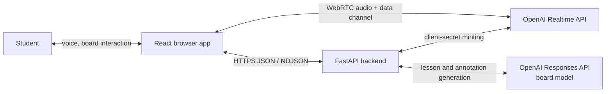
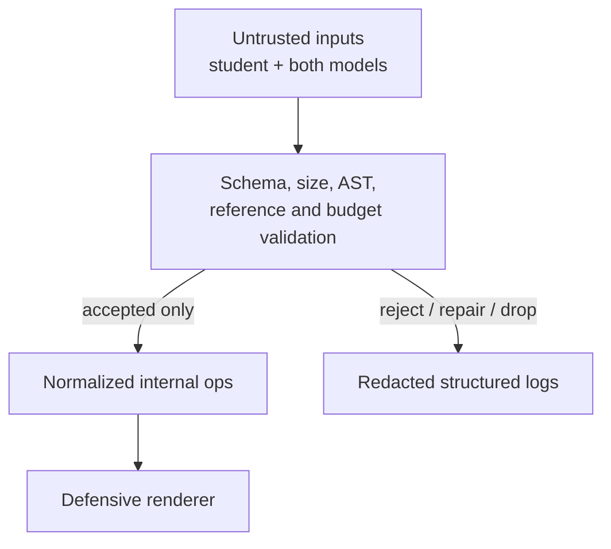
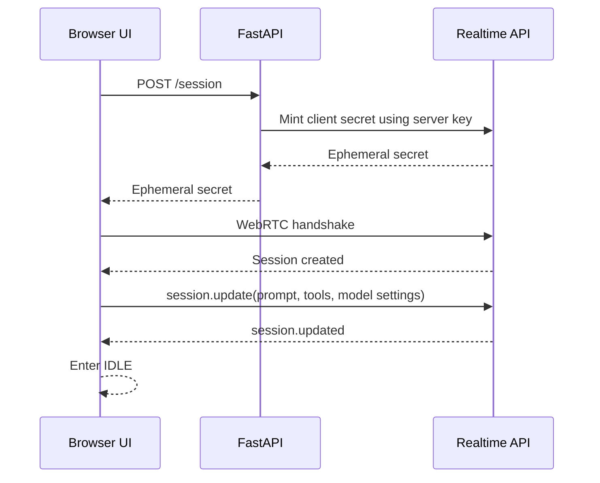
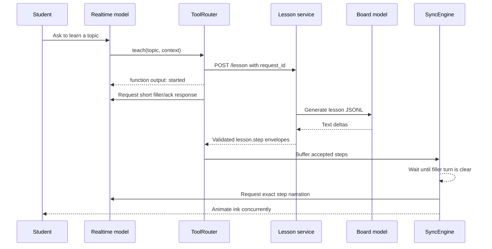
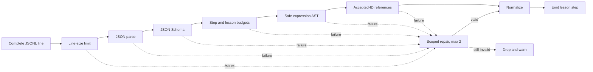
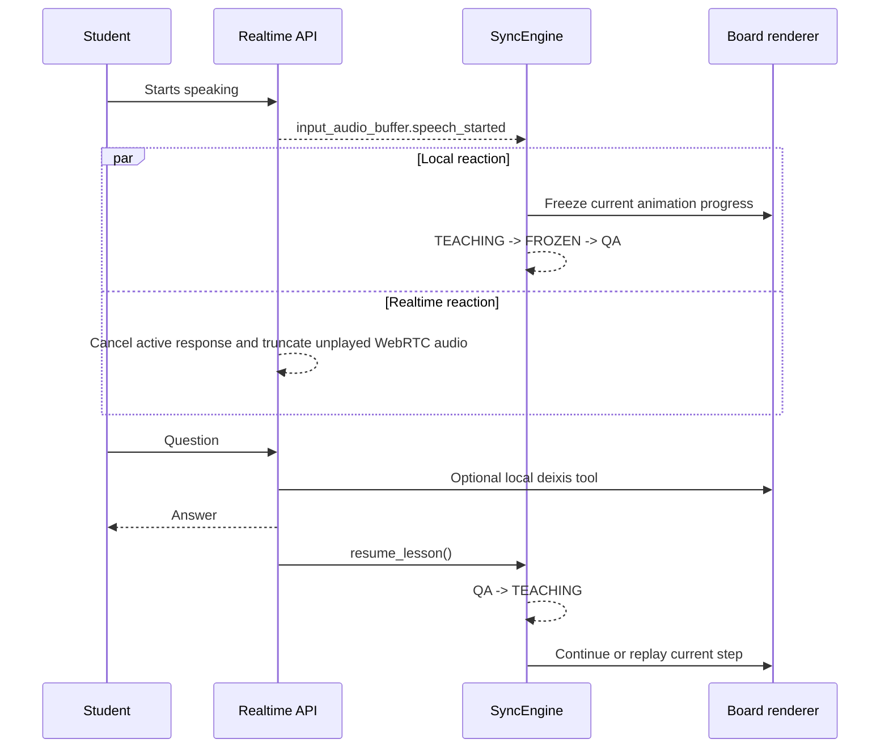
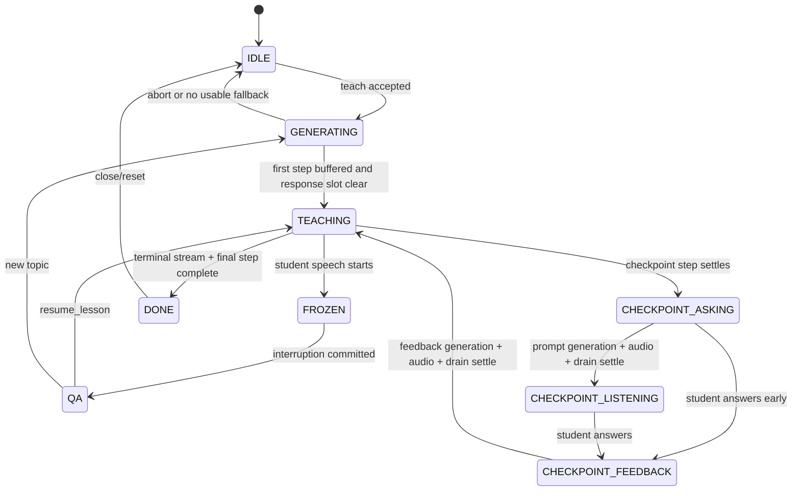

# CHALK architecture

Status: M1 and M2 accepted; M4 cached interaction slice active
Last reviewed: 2026-07-16
Companion documents: `chalk-build-plan.md`, `AGENTS.md`

## Purpose and authority

This document describes how CHALK is intended to work as a system. It captures component boundaries, runtime flows, failure behavior, and decisions that must remain coherent across the frontend and backend.

- `chalk-build-plan.md` defines the product, schedule, and demo story.
- `AGENTS.md` defines audited implementation rules and acceptance standards.
- `ARCHITECTURE.md` defines the current system design and records how it changes as code is built.
- `shared/schema/*.json` will define the actual wire contracts. Once those files exist, they are authoritative for payload shapes; this document should link to them rather than copy them.

Use these status labels throughout:

- **VERIFIED-DOC**: supported by current official documentation, but still requires an account/browser smoke test.
- **DECIDED**: an architectural choice for this project.
- **SPIKE**: deliberately unresolved until measured in the real app.
- **STRETCH**: optional and outside the MVP gate.

Update this document when a component boundary, public contract, state transition, fallback, or security boundary changes. Do not update it for ordinary internal refactors.

## Architectural drivers

In priority order:

1. Interruption must feel immediate: speech and the active stroke stop together.
2. Voice and ink must appear concurrent, even in fallback mode.
3. A malformed model response must never crash or poison the board.
4. The three cached demo lessons must work without board-model availability.
5. Time to first visible ink should be under six seconds for live generation.
6. The system must remain understandable enough to debug during a seven-day build.

This is a localhost hackathon prototype. Availability across regions, persistence, multi-user isolation, horizontal scaling, authentication, and production child-safety requirements are not architectural goals.

## System context



The browser is the orchestration point because it observes both Realtime events and rendered-board progress. The backend is not in the live audio path.

## Core rule: two brains, one deterministic board

**DECIDED:** the Realtime model and board model have separate responsibilities.

| Concern | Owner |
|---|---|
| Conversation, voice, turn-taking, tool selection | Realtime model |
| Lesson and annotation program generation | Board model |
| Tool execution and request correlation | Browser |
| Session secrets and board-model credentials | Backend |
| DSL validation and repair | Backend |
| Final expression compilation and defensive rendering | Browser |
| Visible-board inventory | Browser manifest builder |
| Lesson/interruption state | Browser sync engine |

The Realtime model never produces raw ink operations. The board model never controls audio, turn-taking, or state transitions. The renderer never consumes unvalidated model text.

## Runtime components

### Browser

#### `RealtimeClient`

Owns the `RTCPeerConnection`, remote audio element/stream, data channel, session setup, and translation between OpenAI events and typed internal events.

- Protocol event strings stay inside `frontend/src/realtime/`.
- It exposes semantic events such as `studentSpeechStarted`, `responseCompleted`, `transcriptDelta`, and `toolCallCompleted` to the rest of the app.
- It does not own lesson state or render board elements.
- Demo mode uses product tutor instructions and no diagnostic tool; diagnostics mode restores the evidence UI and `debug_echo` without changing the transport.

#### `RealtimeResponseCoordinator`

Serializes and identifies lesson narration, checkpoint prompts, VAD-created Q&A/feedback, and diagnostic continuations so unrelated `response.created` events cannot claim the wrong lifecycle. It records bounded response purpose, request/step/cycle correlation, and generation/playback settlement.

`response.done` means generation/sending completed; it is not treated as proof that the remote audio buffer is silent.

Manual lesson narration requests carry a client `event_id` and bounded response metadata containing only purpose/request/step/cycle identifiers. The coordinator binds narration only when the echoed metadata matches; a simultaneous VAD-created response cannot claim the lesson cycle. A matching recoverable error releases the pending narration and resets the fixed-sync run. Fixed ink begins on `output_audio_buffer.started`, because transcript deltas indicate generation rather than audible playout.

#### `ToolRouter`

Validates Realtime tool arguments and dispatches:

- instant local tools to the overlay renderer;
- `teach` to the lesson-stream client;
- `annotate` to the backend;
- state-control tools to the sync engine;
- optional widget and vision tools to their adapters.

Every tool result is returned to the Realtime conversation as a function-call output. Unknown tools, invalid arguments, and unknown board IDs return soft machine-readable failures.

#### `LessonStreamClient`

Starts `POST /lesson`, consumes NDJSON with `fetch().body`, handles arbitrary chunk boundaries, and emits only validated stream envelopes. It owns the `AbortController` for the active request.

#### `SyncEngine`

Is the sole writer of lesson lifecycle state. It queues validated steps, schedules narration and animation, freezes/resumes work, and ignores stale events.

Implement it as a reducer/state machine plus explicit effects. React views may dispatch events but may not mutate state directly.

#### Board subsystem

The board subsystem has four layers, bottom to top:

1. accepted lesson ink;
2. temporary deixis and annotation overlays;
3. widgets;
4. student ink.

It contains:

- a schema-derived DSL decoder;
- a region and anchor layout resolver;
- a defensive rough.js/KaTeX renderer;
- a stroke animator that can freeze at its current progress;
- a manifest builder derived from committed visible state.

Rough geometry is seeded by element ID and generated once so React rerenders do not move existing strokes.

### Backend

#### Session service

Mints a short-lived Realtime client secret with the standard OpenAI API key and returns it to the browser. The standard key never leaves the backend.

#### Lesson service

Calls the configured board model through the Responses API, incrementally parses model-produced JSONL, validates and repairs each complete step, and emits accepted steps as NDJSON stream envelopes.

#### Annotation service

Generates a bounded overlay batch from the latest accepted manifest and a student question. It does not create new axes and may return at most five ops.

#### Validation service

Applies JSON Schema, budgets, reference-state validation, safe expression-AST validation, and normalization. It never evaluates model-produced code.

#### Optional services

- **STRETCH:** widget selection and parameterization.
- **STRETCH:** student-sketch vision fallback.

## Trust boundaries



Student speech, typed text, images, Realtime tool arguments, and board-model output are all untrusted. No model output may become HTML, SVG markup, JavaScript, CSS, a URL, a shell command, or an evaluated expression.

## External interfaces

### Backend HTTP API

All endpoints bind to localhost for the demo and accept explicit size limits.

| Endpoint | Response | Purpose |
|---|---|---|
| `POST /session` | JSON | Mint a Realtime client secret |
| `POST /lesson` | `application/x-ndjson` | Stream validated lesson steps |
| `POST /annotate` | JSON | Return a validated overlay batch |
| `POST /widget` | JSON | **STRETCH:** select a widget template |
| `POST /vision` | JSON | **STRETCH:** describe student ink |
| `GET /health` | JSON | Local readiness and configured-feature status |

Every mutating/generating request carries a browser-generated `request_id`. The backend echoes it in logs and responses. It must not log raw audio, image data URLs, authorization headers, client secrets, or raw student utterances.

The M1 `POST /session` request is capped at 4 KiB before JSON parsing. It accepts only canonical UUIDv4 identifiers:

```json
{"request_id":"<uuid-v4>","client_id":"<uuid-v4>"}
```

On success it returns a deliberately narrow projection rather than the raw upstream payload:

```json
{"request_id":"<uuid-v4>","client_secret":"<ephemeral-value>","expires_at":1800000000,"model":"gpt-realtime-2.1-mini","voice":"marin"}
```

`expires_at` is omitted when the upstream response does not provide it. Validated operational failures echo `request_id`; pre-parse size failures and schema failures cannot safely promise correlation. The browser rejects a response whose `request_id` does not match its active mint request.

### Lesson stream protocol

**DECIDED:** the board model may emit step objects as JSONL internally, but the backend-to-browser stream uses typed envelopes. This allows clean terminal and warning states without confusing them with DSL steps.

Illustrative envelopes; the future stream JSON Schema is authoritative:

```json
{"type":"lesson.started","request_id":"req_123"}
{"type":"lesson.step","request_id":"req_123","step":{"id":"s1","script":"...","ops":[],"checkpoint":null}}
{"type":"lesson.warning","request_id":"req_123","code":"step_dropped","step_hint":"s2"}
{"type":"lesson.done","request_id":"req_123","accepted_steps":5}
```

If an unrecoverable upstream failure happens after HTTP headers have been sent, emit `lesson.error` with a non-sensitive code and then close the stream. The browser retains accepted buffered steps and chooses the cached fallback if none were accepted.

Backpressure is bounded: the server awaits each emitted line, and the client keeps a maximum of eight accepted steps. There is no reason to buffer an unbounded lesson.

### Realtime protocol adapter

The following is the official-documentation baseline as of 2026-07-15:

- **VERIFIED-DOC:** browser connections use WebRTC and may authenticate with an ephemeral client secret from `POST /v1/realtime/client_secrets`.
- **VERIFIED-DOC:** `session.update` and `session.updated` update and acknowledge session instructions.
- **VERIFIED-DOC:** VAD emits `input_audio_buffer.speech_started` and `input_audio_buffer.speech_stopped`.
- **VERIFIED-DOC:** output transcript progress is available through `response.output_audio_transcript.delta`.
- **VERIFIED-DOC:** `response.done` reports response completion.
- **VERIFIED-DOC:** WebRTC sessions with VAD interruption enabled automatically cancel the active response and truncate unplayed audio when the user interrupts.
- **VERIFIED-DOC:** `response.done.response.usage` reports billed input/output totals and modality details; input transcription, when enabled, is billed separately.
- **VERIFIED-DOC:** `session.max_output_tokens` can cap each assistant response, and retention-ratio truncation with `token_limits.post_instructions` can bound the rolling conversation input.

Official references:

- <https://developers.openai.com/api/docs/guides/realtime-webrtc>
- <https://developers.openai.com/api/docs/guides/realtime-conversations>
- <https://developers.openai.com/api/docs/guides/realtime-vad>
- <https://developers.openai.com/api/docs/guides/realtime-costs>
- <https://developers.openai.com/api/reference/resources/realtime>

**OBSERVED-LIVE (2026-07-15, Chrome 150):** the metadata-only traces captured connect, narration, dummy-tool output and explicit follow-up `response.create`, resumed audio, cost configuration/usage, and multiple interruptions. Genuine audible interruptions emitted `output_audio_buffer.cleared` immediately after `input_audio_buffer.speech_started`, followed by `conversation.item.truncated`. Crucially, `response.done` can precede the end of audible WebRTC playout by several seconds, while `response.created` can also be cancelled before any output begins. Client teaching state therefore follows matching `output_audio_buffer.started`, `.stopped`, and `.cleared` events: generation completion does not end audible state, and pre-playback cancellation does not count as audible barge-in. After correcting both boundaries, five consecutive playback-backed interruptions passed with zero stale output; the aggregate evidence is checked in under `artifacts/evidence/`.

## Primary flows

### 1. Session startup



Failure before `session.updated` leaves voice controls disabled and shows a retryable local error. The board remains usable for a cached silent lesson during development.

### 2. Starting a lesson



The lesson request is asynchronous from the Realtime function call. A new topic aborts the old HTTP request and increments the active request ID. Late lines from the old request are ignored even if network cancellation races.

### 3. Validating a generated step



Accepted IDs are added only after successful normalization. Later lines cannot refer to IDs from a dropped step.

### 4. Playing a step

The stable mode is `SYNC_MODE=fixed`:

1. `SyncEngine` marks the step active and requests its narration.
2. The first narration delta or observed audio activity starts a fixed weighted animation schedule.
3. Op weights distribute expected duration; configuration clamps minimum and maximum durations.
4. Narration completion and animation completion are tracked independently.
5. The next step waits for both plus a measured audio-drain guard.

`SYNC_MODE=paced` adds a bounded controller that adjusts animation rate from transcript-character progress. It is an enhancement, not a dependency.

**SPIKE:** determine whether remote-audio activity can be measured reliably with a Web Audio analyser in the recording browser. If not, calibrate a small drain guard on cached lessons and document the value.

### 5. Interruption and resume



The half-drawn stroke remains visible during QA. The baseline resume restarts the current narration and continues the frozen ink. If rehearsal shows that this is confusing, reset and replay only the current step; do not build word-level audio alignment.

The browser does not redundantly send `response.cancel` for a VAD interruption unless a live event trace proves the automatic path did not cancel a manually created response.

### 6. Publishing board context

The manifest is derived from committed visible state, never the intended program. After a step, annotation, widget event, or accepted student sketch:

1. Build a compact inventory of visible elements and relevant computed facts.
2. Keep it to approximately 120 tokens.
3. Compose `BASE_TUTOR_PROMPT + latest manifest`.
4. Send it through `session.update({instructions: ...})`.
5. Do not assume publication until `session.updated` is observed.

This replaces prior board context and avoids unbounded conversation-item accumulation.

**SPIKE:** measure instruction-update latency and confirm it does not disrupt an active or immediately following response. `BoardContextPublisher` isolates this mechanism so it can be replaced without touching the renderer or tutor logic.

## State model

### Lesson lifecycle



State carries at least:

- active lesson `request_id`;
- active step ID and index;
- accepted/buffered steps;
- active Realtime response ID and purpose;
- animation progress for the current op batch;
- stream status;
- latest committed manifest version;
- current sync mode;
- recoverable error and fallback status.

Invalid state/event combinations log and do nothing. Events with a stale request or response ID are ignored.

### Board element lifecycle

```text
generated -> validated -> normalized -> laid out -> animating -> committed -> erased
```

Only committed elements appear in the manifest. A frozen element is visible but marked partial internally; whether it enters the manifest during QA is a rehearsal decision. Default: include it as “partially drawn” only if the student can point to it.

## Data model boundaries

The lesson JSON Schema will define steps, ops, anchors, checkpoints, and budgets. Architecture-specific constraints that must be reflected in that schema or validator include:

- unique short IDs;
- no forward references;
- normalized dimensions rather than model-chosen pixels;
- no undeclared curve symbols;
- bounded sketch strokes and points;
- no raw markup or arbitrary renderer options;
- idempotent erase and clear behavior.

Curve expressions cross a two-stage boundary:

1. Python parses a deliberately restricted expression grammar using a safe AST walk and never evaluates it.
2. TypeScript compiles with a locked-down mathjs instance, samples the visible domain, and rejects non-finite or pathological output.

## Concurrency and cancellation

- At most one active lesson generation per browser session.
- At most one default-conversation Realtime response at a time.
- Annotation requests may run during QA but are tied to the manifest version they received. Stale results are discarded.
- A new lesson aborts lesson generation, annotation, pending playback, and optional widget generation from the prior lesson.
- Backend repair calls are sequential per line to preserve accepted-ID order.
- The renderer isolates each op: one render failure cannot cancel sibling ops or the lesson.
- Stream readers must handle cancellation while a partial UTF-8 or JSON line is buffered.

## Failure and fallback policy

| Failure | Local behavior | Fallback |
|---|---|---|
| Session mint/handshake fails | Keep voice disabled; show retry | Cached lesson can run silently for development |
| Tool arguments invalid | Return soft tool error | Tutor asks again or continues without tool |
| Board model slow | Realtime gives short bounded filler | Cached lesson after configured timeout |
| Model line invalid | Repair at most twice | Drop line; validate later refs against accepted IDs |
| Stream fails after steps | Finish accepted buffered steps | Explain lesson ended early; cached restart available |
| No valid live steps | Stop generation cleanly | Load matching cached lesson |
| Renderer op fails | Log and skip only that op | Continue the step |
| Paced sync looks unstable | Change runtime flag | `SYNC_MODE=fixed` |
| Deixis ID missing | Return soft failure | Answer verbally without pointing |
| Manifest publication fails | Retain last acknowledged version | Retry after active response |
| Direct sketch-image path fails | Do not block QA | Backend vision-text fallback |

Fallback activation must be visible in developer diagnostics and `PROGRESS.md`, but the tutor must not say “the API failed” or expose implementation detail during the demo.

## Observability

Use structured, redacted events with monotonic timestamps where possible:

- session connection milestones;
- Realtime event type and correlated response/tool IDs;
- lesson request start, first model delta, first valid step, and terminal status;
- validation and repair outcomes by error code, never raw student text by default;
- animation start/freeze/resume/commit;
- manifest version publish/ack;
- fallback activation;
- uncaught frontend and backend errors.

The developer overlay should show connection status, lesson state, active response purpose, request ID suffix, sync mode, buffered step count, and current fallback. Hide it for recording.

Primary performance measurements:

- session-connect latency;
- tool-call-to-first-valid-step;
- first-valid-step-to-first-stroke;
- detected-speech-start-to-animation-freeze;
- repair rate and dropped-step rate;
- three-run cached-lesson completion rate.

Do not claim perceived audio interruption latency from the animation-freeze measurement.

## Live API test budget

Credentialed API checks are narrow acceptance probes, not load tests. Default automated tests use deterministic fakes and fixtures. Live Realtime validation stays on `gpt-realtime-2.1-mini`, uses brief synthetic speech and bounded responses, and disconnects immediately after the required handshake, tool, or interruption evidence is captured. There are no automatic live retries or credentialed test loops. M1 caps each response at 256 output tokens, bounds the post-instruction conversation window at 4,000 tokens with 0.8 retention, leaves input transcription disabled, displays cumulative billed usage, and auto-disconnects a connection at 20,000 total response tokens. Reconnecting resets that local counter, so it is not an account-wide budget. A larger model, a batch of generated topics, or an extended live session requires explicit owner approval and a recorded reason in `PROGRESS.md`.

## Security and privacy

- Standard OpenAI API keys exist only in backend environment variables.
- Client-secret minting is pinned to the official HTTPS endpoint with redirects and environment-derived proxy routing disabled.
- The browser persists a random UUIDv4; the backend sends only `SHA-256(SAFETY_IDENTIFIER_SALT + ":" + client_id)` as the non-PII safety identifier.
- CORS allows only the explicit local frontend origin.
- Logs redact secrets, authorization headers, audio, image data URLs, and raw student utterances.
- Student context, audio, and sketches remain in memory and are not persisted.
- KaTeX trust is disabled; no model-generated HTML or URLs are rendered.
- Request size, stream duration, expression complexity, sampling work, repair attempts, and concurrent jobs are bounded.
- The README identifies CHALK as a local hackathon prototype, not a production or unsupervised child-learning system.

## Runtime configuration

Expected server-side environment variables:

```dotenv
OPENAI_API_KEY=
REALTIME_MODEL=gpt-realtime-2.1-mini
BOARD_MODEL=gpt-5.6-terra
REALTIME_VOICE=marin
SAFETY_IDENTIFIER_SALT=chalk-local-development-v1
SYNC_MODE=fixed
DRAWBACK_MODE=vision
FRONTEND_ORIGIN=http://localhost:5173
```

`gpt-realtime-2.1` is used for recording after the development path passes on the mini model. `gpt-5.6-sol` is an escalation path only if golden-topic evidence shows that Terra is inadequate.

Client-visible configuration must contain only non-secret feature flags. Never expose `OPENAI_API_KEY` through Vite environment variables.

## Verification gates

### Day 1 protocol spike

- [x] Mint a client secret and complete the WebRTC handshake.
- [x] Capture the actual session-created/update acknowledgement events.
- [x] Confirm voice output and the selected transcript-delta event.
- [x] Confirm a dummy tool-call round trip and required response trigger.
- [x] Interrupt five responses and capture cancellation/truncation behavior.
- [x] Record observed event names and payload fixtures with secrets and content redacted.

### Day 2 board/sync spike

- [x] Hardcoded projectile lesson renders without uncaught errors.
- [ ] Fixed mode starts voice and ink concurrently.
- [x] Rough paths do not jump on rerender.
- [x] Freeze retains a visibly partial stroke in deterministic rendering tests.
- [ ] Response completion plus the chosen drain guard does not overlap steps.

### Day 3 generation spike

- [ ] POST NDJSON survives arbitrary network chunk boundaries.
- [ ] Invalid lines repair or drop without raw forwarding.
- [ ] Dropped IDs cause dependent later references to repair or drop.
- [ ] First valid step reaches the browser within the target on a representative topic.
- [ ] Zero valid steps activates the cached fallback.

### MVP gate

- [ ] Three consecutive cached projectile loops complete.
- [ ] Each loop includes interruption, partial-stroke freeze, grounded answer, and resume.
- [ ] The last acknowledged manifest matches visible committed board state.
- [ ] No known crash exists on the three cached demo lessons.

## Decision record

| ID | Date | Decision | Reason |
|---|---|---|---|
| ADR-001 | 2026-07-15 | Browser connects directly to Realtime with WebRTC | Lowest-latency media path; backend stays out of audio transport |
| ADR-002 | 2026-07-15 | Voice model and board model are separate | Keeps drawing deterministic and interruption conversational |
| ADR-003 | 2026-07-15 | POST lesson streaming uses NDJSON over fetch | Native EventSource does not support POST; matches model JSONL parsing |
| ADR-004 | 2026-07-15 | JSON Schema is the wire-format source of truth | Avoids hand-maintained frontend/backend contract drift |
| ADR-005 | 2026-07-15 | Expression validation is split across safe Python AST and frontend mathjs | Python cannot compile mathjs; both trust boundaries remain defensive |
| ADR-006 | 2026-07-15 | Fixed concurrent sync is the stable fallback | Sequential ink-then-voice contradicts the product promise |
| ADR-007 | 2026-07-15 | Board context publishes through replaceable session instructions | Avoids undocumented system-role conversation items and context growth |
| ADR-008 | 2026-07-15 | Demo lessons are cached and live generation is shown once | Reduces recording risk without hiding the live capability |
| ADR-009 | 2026-07-15 | Layer per-response, rolling-context, and per-connection Realtime token limits | A single post-response ceiling cannot prevent one long answer from overshooting; visible usage and independent bounds make development spend predictable without removing the live path |
| ADR-010 | 2026-07-16 | Publish only successfully rendered, fully revealed geometry in the tutor manifest | Prevents future or failed elements from becoming model-visible claims while preserving a compact replaceable context |
| ADR-011 | 2026-07-16 | Coordinate responses by explicit purpose and use three checkpoint phases | Keeps manual narration, VAD answers, checkpoint prompts, and feedback from stealing each other's lifecycle events or advancing the lesson early |

## Open spike decisions

These must be resolved with measurements, not preference:

1. Server VAD versus semantic VAD for the recording environment.
2. `marin` versus `cedar` for warmth and intelligibility.
3. Remote-audio activity detection versus a calibrated drain guard.
4. Continue-frozen-ink versus replay-current-step on resume.
5. Session-instruction manifest publication latency and timing.
6. Terra versus Sol lesson quality on the ten-topic rubric.
7. Direct Realtime image input for student sketches versus the vision-text fallback.

Record each resolution as a new ADR row with evidence in `PROGRESS.md`.
